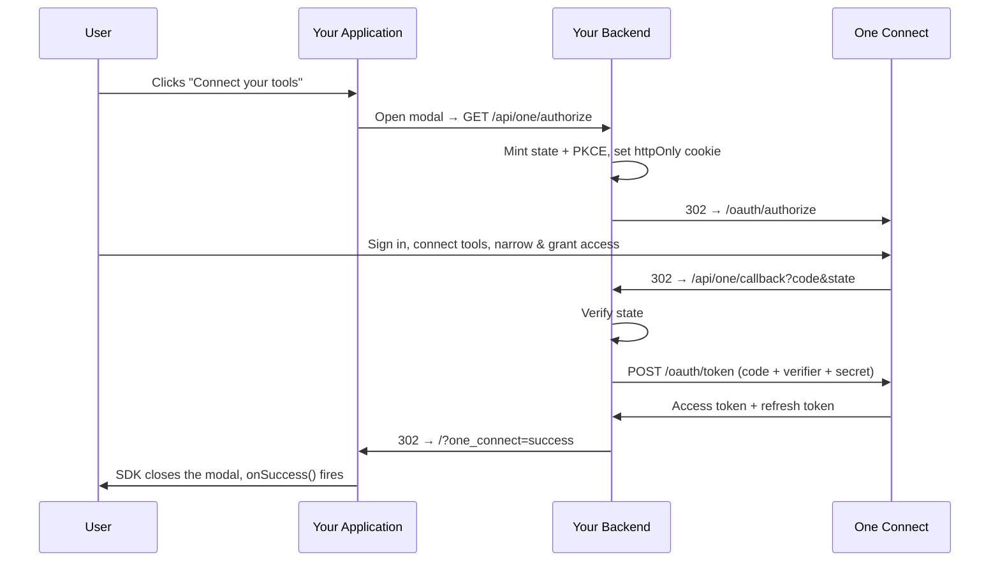

<h3 align="center">One Connect</h3>

<p align="center">
  <a href="https://withone.ai"><strong>Website</strong></a>
  &nbsp;·&nbsp;
  <a href="https://withone.ai/docs/connect"><strong>Docs</strong></a>
  &nbsp;·&nbsp;
  <a href="https://app.withone.ai"><strong>Dashboard</strong></a>
  &nbsp;·&nbsp;
  <a href="https://withone.ai/changelog"><strong>Changelog</strong></a>
  &nbsp;·&nbsp;
  <a href="https://x.com/withoneai"><strong>X</strong></a>
  &nbsp;·&nbsp;
  <a href="https://linkedin.com/company/withoneai"><strong>LinkedIn</strong></a>
</p>

<p align="center">
  <a href="https://npmjs.com/package/@withone/connect"></a>
</p>

One Connect lets your users grant your application **scoped, revocable access to their own One-connected tools** — Gmail, Slack, Notion, Stripe and 500+ more — through the standard OAuth 2.1 authorization-code flow with PKCE.

Your user owns their connections inside One. You never see their Gmail password — you hold a One access token scoped to **exactly what they granted**, and they can narrow or revoke it at any time. One enforces the grant on every call.

Fully compatible with popular frameworks such as React, Next.js, Vue, Svelte, and more.

> **Connect vs. Auth** — [`@withone/auth`](https://github.com/withoneai/auth) puts connections **in your One project** (you own them). Connect puts connections **in your user's own One account** and hands you a scoped grant.

## Install

With npm:

```bash
npm i @withone/connect
```

With yarn:

```bash
yarn add @withone/connect
```

## How it works

Everything sensitive — `state`, the PKCE verifier, your client secret, the tokens — lives on **your server**. The SDK is a thin modal opener: it never touches a token.

You build exactly **two backend routes and one button**.



The SDK watches the modal frame for `?one_connect=` on your own origin — so **there is no completion page to build**.

## 1 · Create your OAuth app

Dashboard → **Settings → OAuth Apps → New OAuth app**.

- You get a **Client ID** (public) and a **Client Secret** (shown once — server-only, never in a browser).
- Register your **redirect URI** (e.g. `https://yourapp.com/api/one/callback`).
- Pick the **access-token lifetime**: 7 days, 30 days, 90 days or 1 year.
- Optionally create a **permission set** — the connectors your app needs and the access level for each (full / read & write / read only / specific actions). Your user sees it pre-filled at consent and can only *narrow* it. Without one, your app asks for access to the user's connections generally, which they can also narrow.

### Environment Variables

```env
ONE_CLIENT_ID=...
ONE_CLIENT_SECRET=one_secret_...
ONE_REDIRECT_URI=https://yourapp.com/api/one/callback
ONE_PERMISSION_SET=79659c66-...
```

| Variable | Required | Description |
|---|---|---|
| `ONE_CLIENT_ID` | Yes | Public client ID from your OAuth app |
| `ONE_CLIENT_SECRET` | Yes | Server-only secret. Never ship to a browser. |
| `ONE_REDIRECT_URI` | Yes | Must exactly match the URI registered in the dashboard |
| `ONE_PERMISSION_SET` | No | Pre-fills the consent screen with the access your app needs |

## 2 · Using the Connect component

Replace the `authorize URL` with your backend authorize endpoint.

> ⚠️ **Must be a full URL** — relative paths like `/api/one/authorize` won't work because the Connect card runs in an iframe. Use the complete URL (e.g., `https://your-domain.com/api/one/authorize`).

```tsx
"use client";

import { useOneConnect } from "@withone/connect";

export function ConnectWithOne() {
  const { open } = useOneConnect({
    authorize: {
      url: "https://your-domain.com/api/one/authorize",
    },
    appTheme: "light",
    onSuccess: () => {
      // Your backend already stored the tokens by the time this fires.
      console.log("Access granted");
    },
    onError: (error) => {
      console.error("Connect failed:", error);
    },
    onClose: () => {
      console.log("Connect modal closed");
    },
  });

  return <button onClick={open}>Connect your tools</button>;
}
```

### Configuration Options

| Option | Type | Description |
|---|---|---|
| `authorize.url` | `string` | Full URL of your backend authorize endpoint. Must be absolute. |
| `appTheme` | `"dark" \| "light"` | Theme for the Connect card. The SDK carries it on the URL fragment — nothing for your backend to forward. |
| `onSuccess` | `() => void` | The grant completed and your server stored the tokens |
| `onError` | `(error: string) => void` | The flow failed, with a human-readable message |
| `onClose` | `() => void` | The user closed the card without a result |

### Returned handle

| Method | Description |
|---|---|
| `open()` | Opens the Connect modal over the current page |
| `close()` | Tears down the modal frame and its listeners |


### Optional: the pre-built button

Any element wired to `open()` works — the button is **optional**. It
ships as a custom element, `<one-connect-button>`, so the SAME tag
works in React, Next, Vue, Svelte, or plain HTML — no refs, no mount
calls. Importing the package registers it. It wires the whole flow
itself and manages Connect → Connecting → Connected.

```tsx
// React / Next (any framework — same tag everywhere)
import "@withone/connect";

export function ConnectWithOne() {
  return (
    <one-connect-button
      authorize-url="/api/one/authorize"
      label="Connect your apps"
      platforms='[{"name":"Stripe","imageUrl":"/icons/stripe.svg"},{"name":"PostHog","imageUrl":"/icons/posthog.svg"}]'
      onSuccess={() => {/* tokens stored server-side — refresh app state */}}
    />
  );
}
```

```html
<!-- Plain HTML / any framework -->
<one-connect-button
  authorize-url="/api/one/authorize"
  label="Connect your apps"
></one-connect-button>
<script>
  document.querySelector("one-connect-button")
    .addEventListener("success", () => location.reload());
</script>
```

| Attribute | What it does |
|---|---|
| `authorize-url` | Your backend authorize route (required) |
| `label` | Button text (default "Connect your apps") |
| `variant` | `default` pill · `accent` brand pill · `block` consent card |
| `theme` | `light` / `dark` — matches YOUR page |
| `app-theme` | Theme for One's card |
| `platforms` | JSON array of `{name, imageUrl}` — provider chips, fan on hover |
| `more-count` | The `+N` chip (e.g. `274`) |
| `description` | Sub-line on the `block` variant |
| `accent-color` | Fill for the `accent` variant (lime fallback) |
| `connected-label` | Label after success |

Events: `success`, `error` (detail = message), `close` — or set the
`onSuccess` / `onError` / `onClose` function props (React 19, Vue and
Svelte set these naturally).

TypeScript + React: add this once so JSX accepts the tag:

```ts
// one-connect-button.d.ts
declare module "react" {
  namespace JSX {
    interface IntrinsicElements {
      "one-connect-button": React.DetailedHTMLProps<
        React.HTMLAttributes<HTMLElement>,
        HTMLElement
      > & {
        "authorize-url"?: string; "app-theme"?: string; label?: string;
        variant?: string; theme?: string; platforms?: string;
        "more-count"?: string; description?: string;
        "accent-color"?: string; "connected-label"?: string;
        onSuccess?: () => void; onError?: (e: string) => void;
        onClose?: () => void;
      };
    }
  }
}
export {};
```

Programmatic alternative: `mountConnectButton(container, options)`
takes the same options as an object (plus `connect: {…useOneConnect
props}`) and returns `{ setState, destroy }`.

## 3 · Backend — the authorize route

Generates `state` (CSRF proof) and PKCE (proof that whoever redeems the code is this server), stashes both in an httpOnly cookie, and 302s the browser to One.

```typescript
// app/api/one/authorize/route.ts (Next.js App Router)
import { createHash, randomBytes } from "crypto";
import { NextRequest, NextResponse } from "next/server";

const ONE_AUTHORIZE_URL = "https://api.withone.ai/oauth/authorize";

export async function GET(req: NextRequest) {
  const state = randomBytes(16).toString("hex");
  const verifier = randomBytes(32).toString("base64url");
  const challenge = createHash("sha256").update(verifier).digest("base64url");

  const url = new URL(ONE_AUTHORIZE_URL);
  url.searchParams.set("client_id", process.env.ONE_CLIENT_ID!);
  url.searchParams.set("redirect_uri", process.env.ONE_REDIRECT_URI!);
  url.searchParams.set("response_type", "code");
  url.searchParams.set("scope", "user:connections:read user:connections:write");
  url.searchParams.set("state", state);
  url.searchParams.set("code_challenge", challenge);
  url.searchParams.set("code_challenge_method", "S256");

  if (process.env.ONE_PERMISSION_SET) {
    url.searchParams.set("permission_set", process.env.ONE_PERMISSION_SET);
  }

  // Optional: your user's email. One pre-fills (never locks) their sign-in.
  const userEmail = await getCurrentUserEmail(req); // ← your code
  if (userEmail) url.searchParams.set("login_hint", userEmail);

  const res = NextResponse.redirect(url.toString(), 302);
  res.cookies.set("one_tx", JSON.stringify({ state, verifier }), {
    httpOnly: true,
    secure: true,
    sameSite: "lax",
    maxAge: 600, // matches One's 10-minute authorization-code lifetime
    path: "/api/one",
  });
  return res;
}
```

## 4 · Backend — the callback route

One redirects back with a **single-use code**, worthless without your secret and the PKCE verifier. Exchange it server-side, store the tokens, then redirect anywhere on your site with `?one_connect=success` appended — the SDK watches the frame for that parameter and closes the modal.

```typescript
// app/api/one/callback/route.ts
import { NextRequest, NextResponse } from "next/server";

const ONE_TOKEN_URL = "https://api.withone.ai/oauth/token";

export async function GET(req: NextRequest) {
  const code = req.nextUrl.searchParams.get("code");
  const state = req.nextUrl.searchParams.get("state");
  const tx = req.cookies.get("one_tx")?.value;

  const parsed = tx ? JSON.parse(tx) : null;
  if (!code || !state || !parsed || parsed.state !== state) {
    return NextResponse.redirect(
      new URL(
        "/?one_connect=error&one_connect_message=" +
          encodeURIComponent("The sign-in attempt expired or was tampered with."),
        req.url,
      ),
      302,
    );
  }

  const basic = Buffer.from(
    `${process.env.ONE_CLIENT_ID}:${process.env.ONE_CLIENT_SECRET}`,
  ).toString("base64");

  const tokenRes = await fetch(ONE_TOKEN_URL, {
    method: "POST",
    headers: {
      Authorization: `Basic ${basic}`,
      "Content-Type": "application/x-www-form-urlencoded",
    },
    body: new URLSearchParams({
      grant_type: "authorization_code",
      code,
      redirect_uri: process.env.ONE_REDIRECT_URI!,
      code_verifier: parsed.verifier,
    }),
  });

  const res = NextResponse.redirect(
    new URL(
      tokenRes.ok
        ? "/?one_connect=success"
        : "/?one_connect=error&one_connect_message=" +
          encodeURIComponent("Token exchange failed."),
      req.url,
    ),
    302,
  );
  res.cookies.delete("one_tx");

  if (tokenRes.ok) {
    // { access_token, refresh_token, token_type: "bearer", expires_in, scope }
    const tokens = await tokenRes.json();
    await saveOneTokens(req, {                    // ← your code
      accessToken: tokens.access_token,
      refreshToken: tokens.refresh_token,
      expiresAt: Date.now() + tokens.expires_in * 1000,
    });
  }
  return res;
}
```

**Token response (200):**

```json
{
  "access_token": "one_at_...",
  "refresh_token": "one_rt_...",
  "token_type": "bearer",
  "expires_in": 2592000,
  "scope": "user:connections:read user:connections:write"
}
```

## 5 · Backend — refreshing the token

Access tokens last as long as you chose when creating the app (7 days to 1 year). Refresh tokens last **30 days** and are **rotated on every use** — always store BOTH new tokens. Reusing an old refresh token revokes the entire token family (theft protection).

```typescript
const ONE_TOKEN_URL = "https://api.withone.ai/oauth/token";

export async function getOneAccessToken(userId: string): Promise<string> {
  const t = await loadOneTokens(userId);           // ← your code
  if (Date.now() < t.expiresAt - 60_000) return t.accessToken;

  // The refresh exchange is authenticated exactly like the code exchange —
  // same Basic header. The public-client form (client_id in the body, no
  // secret) is rejected with 401.
  const basic = Buffer.from(
    `${process.env.ONE_CLIENT_ID}:${process.env.ONE_CLIENT_SECRET}`,
  ).toString("base64");

  const res = await fetch(ONE_TOKEN_URL, {
    method: "POST",
    headers: {
      Authorization: `Basic ${basic}`,
      "Content-Type": "application/x-www-form-urlencoded",
    },
    body: new URLSearchParams({
      grant_type: "refresh_token",
      refresh_token: t.refreshToken,
    }),
  });
  if (!res.ok) throw new Error("One refresh failed — re-run the connect flow");

  const tokens = await res.json();
  await saveOneTokens(userId, {                    // BOTH tokens — rotation!
    accessToken: tokens.access_token,
    refreshToken: tokens.refresh_token,
    expiresAt: Date.now() + tokens.expires_in * 1000,
  });
  return tokens.access_token;
}
```

## 6 · Backend — using the grant

The bearer token works on One's standard `/v1` API — the same routes every other credential uses.

```typescript
const token = await getOneAccessToken(userId);

// Discover what the user granted. Ungranted connections are invisible,
// not merely forbidden.
const res = await fetch("https://api.withone.ai/v1/connections", {
  headers: { Authorization: `Bearer ${token}` },
});
```

Execute actions through `/v1/passthrough/*` with the same bearer. Every call is checked inside One against what the user granted — a call outside the grant returns `403`, and your code cannot override it. That is the point.

## Custom completion pages

The standard integration needs no completion page: your callback's final redirect carries `?one_connect=success` on any same-origin URL, and the SDK reads it off the frame directly.

If you render your own completion page instead, signal the SDK explicitly:

```tsx
import { completeOneConnect } from "@withone/connect";

// Returns false when there was nothing to do (not inside a frame) —
// render fallback UI in that case.
completeOneConnect({ status: "success" });
```

## What your users see

In their own One dashboard, your app appears under **Authorized apps** with what they granted and when it was last used. They can revoke it at any time — handle `401`/`403` by prompting them to reconnect.

In *your* dashboard, your OAuth app lists every user who granted access, and you can revoke individual users too.

## Security notes

- The client secret lives on your server only. Authenticate the token exchange with the `Authorization: Basic` header, as shown above.
- The authorization code is single-use and expires in 10 minutes.
- The SDK never handles tokens. It opens One's card in a modal iframe and watches for the `?one_connect=` result — there is nothing sensitive in the browser to leak.
- The SDK only trusts messages originating from its own iframe, and only accepts results from your own origin.

## License

This project is licensed under the GPL-3.0 license. See the [LICENSE](LICENSE) file for details.
